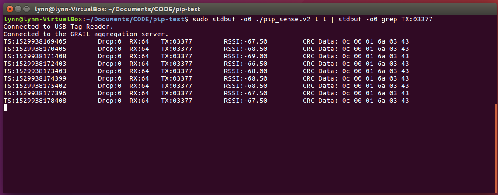

# Tutorial for PIP-Tag

### Hardware Prerequisite:
 1. USB receiver plugged in.
 2. PIP tag installed with a battery。

### Programs

 **1. How to make file.**

- dependencies:
  > g++ gnu compiler

  > essential (install: `sudo apt-get install build-essential`)
 
  > usblib ( install: `sudo apt-get install libusb-dev`)
 
  > sample_data.hpp
 
  > simple_sockets.hpp
 
  > sensor_aggregator_protocol.hpp
 
  > libcurl

- compile:

  `$ g++ -g -std=gnu++0x -o pip_sense.v2 pip_sense_layer.v2.cpp -lusb -lcurl`

 **2. How to run and collect data in terminal.**

- general: 
  
  `$ sudo stdbuf -o0 ./pip_sense.v2 l l | stdbuf -o0 grep TX:0$1 |tee $2`

- my: (in order to receive msg from tag:03377)
  
  `$ sudo stdbuf -o0 ./pip_sense.v2 l l | stdbuf -o0 grep TX:03377`

Result:

